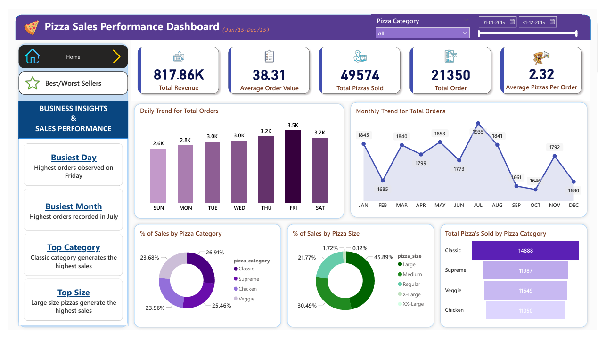
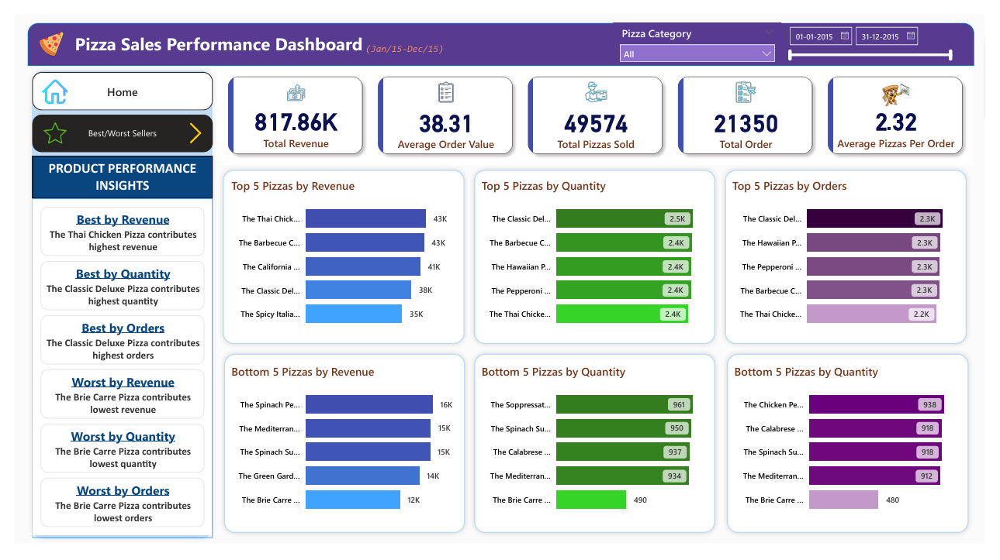

# 📊 Pizza Sales Performance Dashboard

## 📌 Overview
This project analyzes pizza sales data using SQL and visualizes key business insights through an interactive Power BI dashboard.

It focuses on identifying sales trends, top and bottom performing products, and customer ordering behavior.

---

## 📷 Dashboard Preview

  


---

## 🎯 Key Insights
- Identified top 5 and bottom 5 pizzas based on revenue, quantity, and orders  
- Analyzed daily and monthly order trends  
- Determined highest contributing pizza categories and sizes  
- Evaluated overall sales performance using key KPIs  

---

## 🛠️ Tools Used
- SQL (T-SQL)
- Power BI (Data Visualization)

---

## 🗄️ SQL Analysis
SQL was used to perform data analysis and extract business insights before building the dashboard.

### Key Operations:
- Aggregations (SUM, COUNT, AVG)  
- KPI calculations  
- Trend analysis  
- Percentage contribution analysis  
- Ranking using window functions (DENSE_RANK)  

---

## 📊 Dashboard Features
- KPI Metrics (Revenue, Orders, Avg Order Value, Pizzas Sold)  
- Daily & Monthly Sales Trends  
- Sales Distribution by Category & Size  
- Top 5 & Bottom 5 Performing Pizzas  
- Interactive filters for dynamic analysis  

---

## 📂 Project Structure
```bash
pizza-sales-powerbi-dashboard/
│
├── dataset/
│   └── pizza_sales.csv             
│
├── images/
│   ├── home_dashboard.png
│   ├── best_worst_dashboard.png
│
├── scripts/
│   └── pizza_sales_analysis.sql
│
├── Pizza_Sales_Report.pbix
└── README.md
```
---

## 🚀 How to Use
1. Download the `.pbix` file  
2. Open it in Power BI Desktop  
3. Explore the dashboard using filters and visuals  

---

## 👨‍💻 About Me

Hi, I'm Mandar Yangal — a data enthusiast with experience in SQL, Python, and data workflows. I enjoy working across different areas of data including analysis, engineering, and visualization to solve problems and derive insights.

---

🔗 **Connect with me:**  

[](https://my-portfolio-eight-lime-40.vercel.app/) [](https://www.linkedin.com/in/mandar-yangal-a72098262) [](https://www.instagram.com/mr.maddy150912/) [](mailto:mandar.yangal15@gmail.com)

---

⭐ If you found this project useful, feel free to star the repository!
